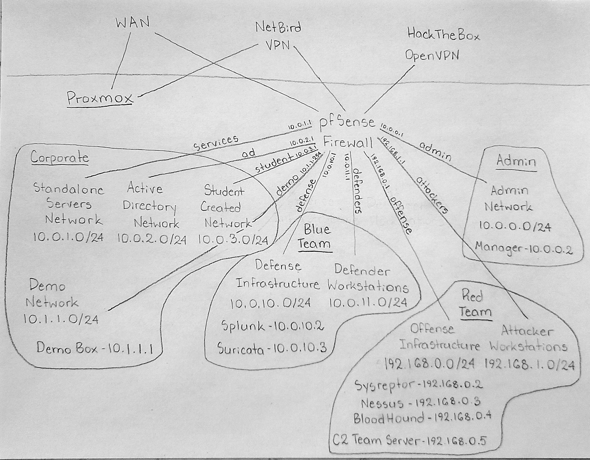

# Network and infrastructure layout

The full Proxmox network layout this project runs on, based on the team's
own network diagram below plus what's actually live on the hypervisor
today. For the AD domain itself, see the main [README](../README.md) and
[CLAUDE.md](../CLAUDE.md).

## The shape of it

One Proxmox host runs everything. A single **pfSense VM is the router for
every segment** below — nothing on one segment reaches another except
through it. Three ways in: **WAN**, **NetBird VPN** (this project's own
control-host access), and **HackTheBox OpenVPN** (a separate access path,
not used by this repo).

| Zone | Segment | Subnet | Gateway | Hosts |
|---|---|---|---|---|
| **Corporate** | `services` | 10.0.1.0/24 | 10.0.1.1 | Standalone servers |
| | `ad` | 10.0.2.0/24 | 10.0.2.1 | **This repo** — `cyberhawks.lab` |
| | `student` (aka `cptc11`) | 10.0.3.0/24 | 10.0.3.1 | Student-created network — see note below |
| **Demo** | `demo` | 10.1.1.0/24 | 10.1.1.254 | Demo Box — 10.1.1.1 |
| **Blue Team** | `defense` | 10.0.10.0/24 | 10.0.10.1 | Splunk — 10.0.10.2 · Zeek — 10.0.10.3 (see note below) |
| | `defenders` | 10.0.11.0/24 | 10.0.11.1 | Defender workstations — **planned, not built yet** |
| **Red Team** | `offense` | 192.168.0.0/24 | 192.168.0.1 | SysReptor — .2 · Nessus — .3 · BloodHound — .4 · C2 team server — .5 |
| | `attacker` | 192.168.1.0/24 | 192.168.1.1 | Attacker workstations (per-student pairs) |
| **Admin** | `admin` | 10.0.0.0/24 | 10.0.0.1 | Manager — 10.0.0.2 |

Everything outside **Corporate → `ad`** is out of this repo's scope
(separately managed) — it's listed here for orientation, not because this
repo touches it.

**Two notes worth flagging:**

- **`defense` (10.0.10.3) runs Zeek, not Suricata.** The team's diagram
  labels this box "Suricata" as the general name for "the IDS host" — Zeek
  is what's actually deployed and verified there (see
  [defense-tooling](https://github.com/CyberHawks-IIT/defense-tooling)).
- **`student`/`cptc11`** is the student-created network by design. It
  currently happens to hold a leftover environment from last year's
  Collegiate Penetration Testing Competition — that content is incidental
  and irrelevant to this project, not a second team's infrastructure to
  avoid.

## Manual setup this repo doesn't script

- **Windows VM templates and cloudbase-init** — built and documented in
  [AttackerVMs](https://github.com/CyberHawks-IIT/AttackerVMs), not here.
- **Two unfixed template bugs** (workarounds in [CLAUDE.md](../CLAUDE.md)):
  templates 300/302 sometimes skip their static-IP cloud-init on first
  boot; template 304 can hit a stale Cloudbase-Init execution-state key
  that skips networking entirely.
- **Defense tooling's prerequisites** (privileged-container gotchas, the
  `snippets` storage type, Splunk's login-gated downloads) live in
  [defense-tooling's docs](https://github.com/CyberHawks-IIT/defense-tooling/tree/main/docs).
